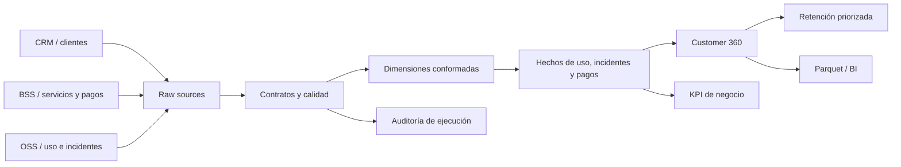

# Telecom Customer 360 & Retention Intelligence

Solución analítica completa para consolidar clientes, servicios, consumo,
incidentes, pagos y calidad de servicio de telefonía fija, internet y
televisión. El repositorio implementa un pipeline reproducible, un modelo
dimensional, controles de calidad, trazabilidad de ejecuciones y productos de
datos listos para BI.

> Los datos son sintéticos y reproducibles. La solución demuestra criterios de
> ingeniería aplicables a producción sin exponer información de organizaciones.

## Capacidades

- Ingesta multifuente de clientes, servicios, uso, incidentes y pagos.
- Modelo dimensional con dimensiones conformadas y tablas de hechos.
- Customer 360 con valor anualizado, calidad, disponibilidad, cobranza y riesgo.
- Priorización de retención con acciones P1–P4 explicables.
- KPI por línea de negocio, ciudad y segmento.
- Validaciones de contrato, integridad, unicidad y reglas financieras.
- Auditoría de ejecuciones y resultados de calidad en DuckDB.
- Exportación Parquet ZSTD y manifiesto JSON para consumidores downstream.
- Ejecución transaccional, semilla determinística y pruebas automatizadas.

## Arquitectura



## Ejecución

```bash
python -m venv .venv
.venv/Scripts/pip install -r requirements.txt
.venv/Scripts/python -m src.build_mart --customers 1000
.venv/Scripts/pytest -q
```

En Linux/macOS, use `.venv/bin/python` y `.venv/bin/pip`.

## Productos de datos

| Producto | Propósito |
|---|---|
| `mart_customer_360` | Visión integral por cliente y scoring de riesgo |
| `mart_retention_priority` | Cola de acciones de retención P1–P4 |
| `mart_business_line_kpi` | Ingreso, disponibilidad, incidentes y SLA por línea |
| `mart_city_segment_performance` | Desempeño geográfico y por segmento |
| `data_quality_result` | Evidencia de controles ejecutados |
| `etl_run` | Trazabilidad de ejecuciones |

Los artefactos de consumo se escriben en `data/exports/` como Parquet y el
archivo `run_manifest.json` registra configuración, conteos y controles.

## Criterios de producción

La implementación local es completa y sustituible por fuentes reales. Para un
despliegue empresarial se deben externalizar secretos, conectar el catálogo
corporativo, aplicar clasificación de PII, definir retención y ejecutar pruebas
de volumen con los SLA del dominio.
