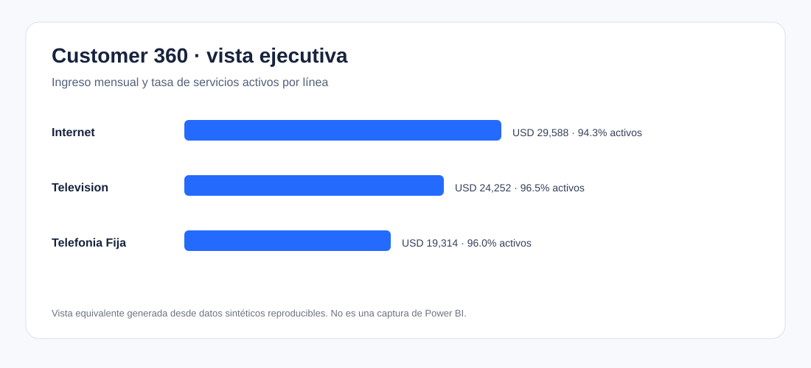

# Telecom Customer 360

Proyecto de ingeniería analítica para consolidar servicios de telefonía fija, internet y televisión en una vista Customer 360 consumible desde Power BI. El repositorio implementa un flujo reproducible, controles de calidad, esquema estrella, marts, catálogo de KPI y artefactos visuales verificables.

> **Datos:** toda la información es sintética, determinística y generada localmente. No contiene clientes, operaciones ni métricas de una empresa real.



## Resumen ejecutivo

El pipeline transforma un snapshot sintético de servicios en un modelo dimensional DuckDB con tres dimensiones, una tabla de hechos y dos marts. Publica CSV para BI, ejecuta trece controles de calidad y genera hallazgos y una visualización SVG directamente desde los resultados. La regla de riesgo es una segmentación descriptiva y transparente; no sustituye un modelo predictivo ni autoriza acciones automáticas.

**English summary:** Reproducible telecom analytics project that turns deterministic synthetic service data into a documented DuckDB star schema, quality controls, BI-ready exports, DAX measures and an executive Customer 360 view.

## Problema

Cuando clientes, productos, ingresos, uso e incidentes permanecen separados por línea de negocio, resulta difícil conocer la relación completa, priorizar revisiones de servicio y comparar el desempeño del portafolio con definiciones consistentes.

## Solución

```text
Generador sintético con semilla
          │
          ▼
Polars + controles en memoria ──► raw_services
                                      │
                                      ▼
                         DuckDB / esquema estrella
                                      │
                     ┌────────────────┴──────────────┐
                     ▼                               ▼
              Customer 360                  KPI por línea
                     └──────── CSV + DAX + diseño BI ────────┘
```

La arquitectura y las relaciones se detallan en [docs/model.md](docs/model.md).

## Tecnologías

- Python 3.11+, Polars y PyArrow para generación y validación.
- DuckDB y SQL para dimensiones, hechos, marts y controles referenciales.
- Pytest para pruebas funcionales y de calidad.
- Power BI como destino de consumo; DAX y diseño están versionados sin fabricar un PBIX.
- GitHub Actions para validación en cada `push` o `pull_request`.

## Modelo de datos

El grano de `fact_service_snapshot` es **un servicio contratado por fecha de corte**. Se relaciona con `dim_customer`, `dim_service_plan` y `dim_date`. Consulta el [diccionario de datos](docs/data_dictionary.md), el [catálogo de KPI](docs/kpi_catalog.md) y las [consultas analíticas](sql/analysis_queries.sql).

## Ejecución

Windows PowerShell:

```powershell
python -m venv .venv
.venv\Scripts\python -m pip install -r requirements.txt
.venv\Scripts\python -m src.build_mart --customers 1000 --seed 42
```

Linux/macOS:

```bash
python -m venv .venv
.venv/bin/python -m pip install -r requirements.txt
.venv/bin/python -m src.build_mart --customers 1000 --seed 42
```

La ejecución crea, sin necesidad de descargar datos:

- `data/telecom.duckdb`.
- `data/exports/customer_360.csv`.
- `data/exports/business_line_kpi.csv`.
- `data/exports/service_snapshot.csv`.
- `docs/results/findings.md` y `docs/results/dashboard_preview.svg`.

## Power BI

Importa los tres CSV desde `data/exports`, configura las relaciones descritas en [powerbi/dashboard_spec.md](powerbi/dashboard_spec.md) y copia las medidas de [powerbi/measures.dax](powerbi/measures.dax). La creación y revisión manual del PBIX queda pendiente porque este repositorio no fabrica binarios de Power BI.

## Pruebas y calidad

```powershell
.venv\Scripts\python -m pytest -q
```

Las pruebas cubren reproducibilidad por semilla, errores de entrada, detección de valores inválidos, esquema estrella, integridad referencial, exportaciones, controles SQL y generación de reportes. `data_quality_results` permite auditar los controles dentro de DuckDB.

## Resultados verificables

Con `--customers 1000 --seed 42`, los resultados vigentes se regeneran en [docs/results/findings.md](docs/results/findings.md). Son observaciones sobre datos sintéticos y no se presentan como impacto empresarial real.

## Decisiones técnicas

- Snapshot como grano para que ingresos, uso, incidentes y estado tengan una fecha explícita.
- Semilla configurable para reproducir pruebas y comparaciones.
- Reglas de calidad duplicadas en Python y SQL para fallar temprano y dejar trazabilidad consultable.
- Regla de riesgo explicable para una implementación analítica reproducible; no se etiqueta como machine learning.
- CSV como contrato portátil hacia Power BI, sin versionar bases, modelos ni datos generados.

## Limitaciones

- Un único corte temporal no permite estudiar tendencia, cohortes o estacionalidad.
- La fuente sintética simplifica facturación, hogares, productos, bajas y eventos operativos.
- El umbral de riesgo no ha sido calibrado con resultados reales ni revisión de negocio.
- No incluye gateway, actualización incremental, RLS, despliegue a Power BI Service ni PBIX.

## Próximos pasos

1. Validar el catálogo de KPI y reglas con dueños de datos.
2. Incorporar snapshots históricos y dimensiones lentamente cambiantes.
3. Añadir costos de servicio, campañas y resultados de retención.
4. Implementar RLS, refresh incremental y monitoreo de actualización en Power BI Service.

## Capturas

La imagen superior es una visualización equivalente generada desde el mart. El diseño detallado del dashboard se encuentra en [powerbi/dashboard_spec.md](powerbi/dashboard_spec.md).

## Licencia

Código disponible bajo [MIT](LICENSE). Los datos generados son exclusivamente sintéticos y están destinados a aprendizaje y evaluación técnica.
