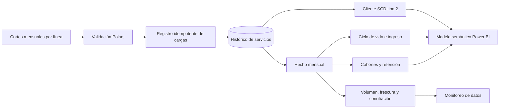

# Arquitectura histórica de Customer 360

El identificador de ejecución y la huella SHA-256 evitan procesar dos veces el mismo lote. Un identificador repetido con contenido distinto se rechaza. La dimensión de clientes conserva cambios de ciudad y segmento con vigencias, mientras el hecho mantiene el grano servicio-mes.

## Contratos publicados

| Salida | Grano | Uso |
|---|---|---|
| `fact_service_monthly` | Servicio y mes | Ingreso, uso, incidentes y estado |
| `dim_customer_scd2` | Versión de cliente | Atributos con vigencia histórica |
| `mart_customer_lifecycle` | Cliente y mes | Altas, reactivaciones, expansión, contracción y bajas |
| `mart_cohort_retention` | Cohorte y edad | Retención mensual |
| `data_observability_monthly` | Mes | Volumen, variación y conciliación |

