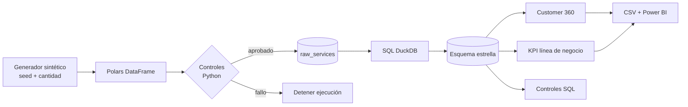
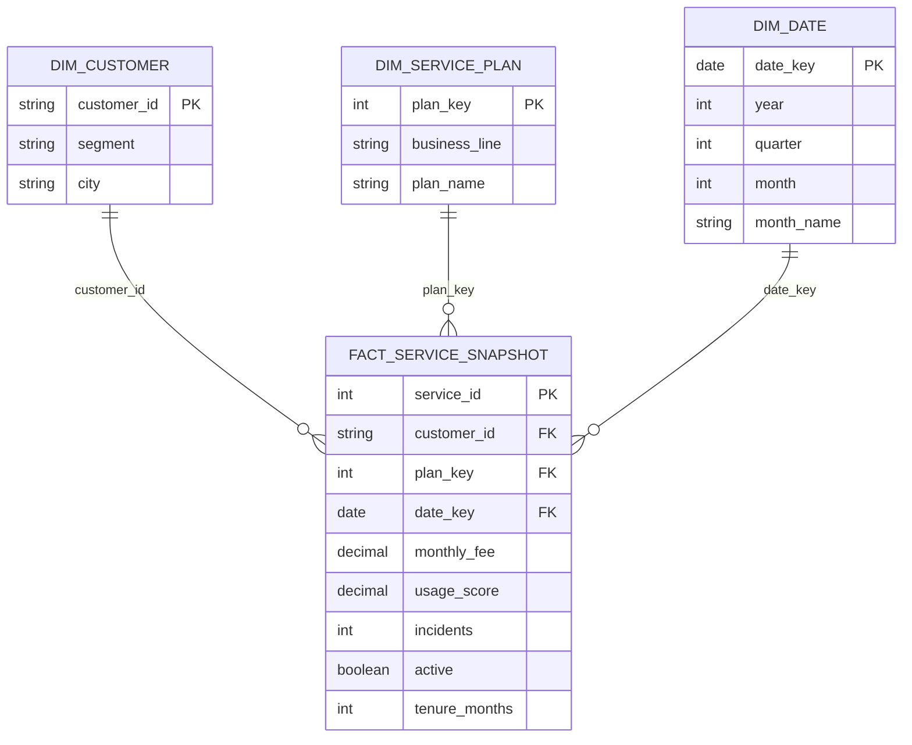

# Arquitectura y modelo dimensional

## Flujo

## Estrella

El grano no debe mezclarse con eventos de uso ni pagos. En una implementación real, esos procesos tendrían hechos separados y dimensiones conformadas.
